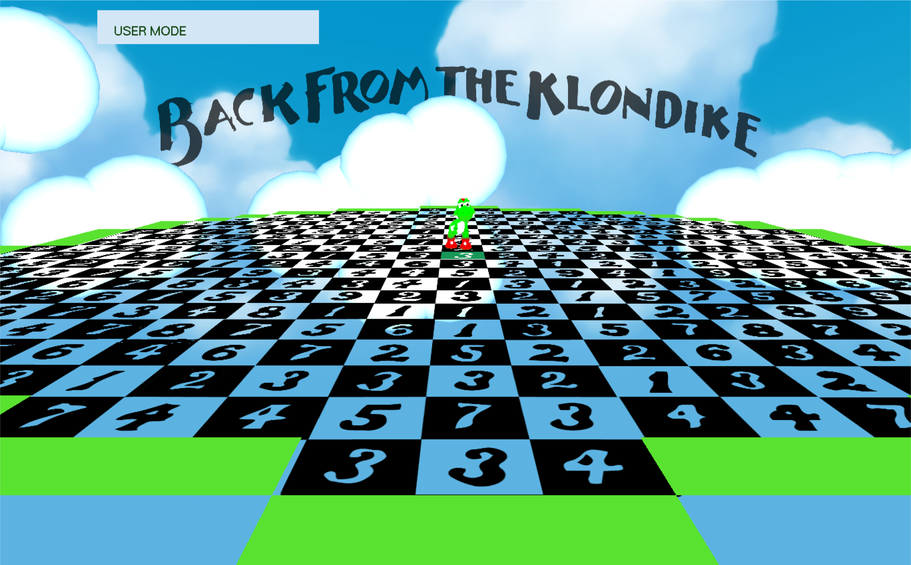

# Back from the Klondike



## INTRODUCCIÓN

El proyecto realizado se basa en el juego de estrategia Back from Klondike, en él se podrá jugar en modo manual o un
modo automático que te va mostrando la solución. Todo el código esta escrito en inglés para dar continuidad al
lenguaje c++ estricto con sintaxis anglosajona y poder compartir posteriormente este código en GitHub para cualquier
desarrollador.

Este programa ha sido compilado correctamente el Ubuntu, Windows y MacOS y debería ser compatible con el resto de
plataformas unix.

# GUÍA DE COMPILACIÓN

Se facilita una guía de compilación para las distintas plataformas.

**IMPORTANTE** Los ejecutables creados a partir de uno de estos métodos no se deben mover a otra ubicación. Durante
su ejecución necesita archivos que se encuentran en esa misma carpeta del proyecto.

**WINDOWS**

Se incluye un proyecto de Microsoft Visual Studio que incluye las librerías necesarias para compilar el proyecto para la
plataforma WIN32. Abra el archivo **Base Klondike.vcxproj** , comprueba que está en la plataforma **WIN32** con la
configuración **RELEASE** y no 64 y pulsa la tecla **F5**. En la carpeta del proyecto se creará un ejecutable **klondike-
windows.exe.**

Si desea usar otro compilador para Windows distinto de MVS, como mingw o cygwin, deberán introducir manualmente
las librerías

**MACOS**

Se facilita un **makefile** para compilar el proyecto. Acceda a la carpeta del proyecto a través del **terminal** y ejecute el
siguiente comando

```bash
$ make build-mac
```
Se creará el ejecutable **klondike-mac** en la carpeta del proyecto. Si prefiere compilarlo manualmente compruebe
comparándolo con el makefile que añade las librerías y archivos necesarios

**UBUNTU (UNIX)**

Para compilar este programa es necesario tener GLUT instalado en el ordenador. Una forma rápida de hacerlo es a
través del siguiente comando:

```bash
$ sudo apt - get install freeglut3 - dev
```
Se facilita un **makefile** para compilar el proyecto. Acceda a la carpeta del proyecto a través del **terminal** y ejecute el
siguiente comando

```bash
$ make build-linux
```
Se creará el ejecutable **klondike-linux** en la carpeta del proyecto. Si prefiere compilarlo manualmente compruebe
comparándolo con el makefile que añade las librerías y archivos necesarios


## DIAGRAMA DE COMUNICACIÓN DE LAS FASES DEL JUEGO MÁS INTERESANTES

Desde _main()_ se configura toda la parte gráfica de OpenGL y se añaden los _callbacks_ de las funciones principales de
OpenGL, y se llama al método _init() de_ **_Game_** que carga las texturas.

OpenGL llama al método **_dra_** _w()_ de Game cada vez que quiere pintar todas las figuras por pantalla y este se encarga de
dibujar cada **_Figure_** y mostrar sus texturas y animaciones.

Las clases **_Keyboard_** y **_Mouse_** tienen cada una un método que se ejecutan cuando se interacciona con el teclado o el
ratón respectivamente. Estos métodos llaman a métodos de la clase _Game_ que se encargan de cambiar parámetros de
configuración o cambiar el camino recorrido por el jugador, estos cambios se ven reflejados visualmente cuando
OpenGL llama de nuevo al método **_draw()_** de la clase Game.

En conclusión, Game es la clase principal del juego que gestiona por un lado la parte visual del juego usando funciones
básicas de OpenGL y por otro lado sus atributos establecen el estado en el que se encuentra el juego y sus métodos
permiten modificar ese estado.

## DESCRIPCIÓN GENERAL DE FUNCIONES Y ESTRUCTURAS MÁS REPRESENTATIVAS

Para permitir una mayor legibilidad se ha organizado la mayor parte del código en clases. Aunque se ha implementado
varias funciones, main() es la más relevante.

_-_ **_Main()_**_._ Función origen que ejecuta las funciones básicas de configuración de OpenGl ( _glutInit,_
    _glutInitDisplayMode, glutCreateWindow, ...)_ , añade los _callbacks_ de las funciones principales de OpenGl e
    inicializa la clase Game (Inicializaba las texturas).

Muchas de las clases son estáticas ya que son clases que deben tener una única instancia accesible a través de todo el
programa. Entre estas clases se encuentran por ejemplo `**_Game_**` _,_ **_Keyboard_** _,_ **_Mouse_** _,_ **_Window_** o **_Perspective_**.

# DESCRIPCIÓN GENERAL DE LAS CLASES MÁS REPRESENTATIVAS

Se realizará una breve explicación de las clases más representativas, para explicación más exhaustiva se pueden revisar
los comentarios en el código.

- **Game:** Es una clase estática que se encarga del control del juego por medio de los atributos estáticos tablero,
    personaje, decoraciones, camino seguido, lista de casillas de la solución y el modo de juego.
    Algunos de los métodos a destacar en game son: **_solve_** _(resuelve el juego),_ **_draw_** _(dibuja las figuras del juego),_
    **_changeMode_** _(cambia el modo de juego), init (carga las texturas necesarias) y_ **_next_** _/_ **_nextStepInSolution_**
    (avanza una casilla en el modo manual o en el automático respectivamente)
- **Figure:** La clase figura contiene los atributos de posición, rotación y altura (cuando la figura está saltando),
    comunes a todas las figuras (existen las figuras tablero, casilla, nube y Yoshi).
    Los métodos a destacar en figura son _move (mueve la figura), jump (hace que la figura salte), rotate (hace que_
    _la figura rote), draw (es un método virtual puro, ya que se dibuja cada figura que forma específica)._
- **Board:** Es una clase que extiende de las clases figura y textura. Tiene los atributos del tamaño de cada casilla y
    la matriz que contiene todas las casillas (representación del tablero de juego). Los métodos empleados
    permiten acceder a las casillas mediante su posición relativa respecto a la casilla de salida.


- **Box (Casilla):** Es una clase que extiende de la clase figura. Cuenta con los siguientes atributos:
    - Posición relativa respecto casilla de salida
    - Número de pasos a realizar.
    - Status. Casilla del momento, casilla pasada.
    - Casilla anterior del camino (puntero).
       - Referencia al tablero (mediante puntero).
       - Tipo de casilla (normal, goal o fuera).
       - State. Revisado o sin revisar para el algoritmo
          de búsqueda
Los métodos empleados son en su mayoría de tipo **_get_** y **_set_** , para obtener los valores de los atributos.
También se utiliza un método para obtener la posible casilla a las que se puede acceder según una dirección
determinada.
- **Keyboard/Mouse:** Se emplean ambas clases para controlar el programa mediante las órdenes del usuario que
    realiza con teclado y ratón. Los métodos empleados son los que mandan información cada vez que se emplea
    ratón o teclado y llaman a métodos de la clase _Game_ encargada del control del juego.
- **Path:** Contiene una lista de referencias a las casillas por las que ha pasado el personaje principal. Los métodos
    a destacar son **_addBox_** _(añade una casilla a la lista) y_ **_clear_** _(vacía la lista)._

Otras clases no tan importantes pero si necesarias son **_Perspective_** , que controla la perspectiva del observador con
respecto a los objetos opengl; **_Position_** / **_Position2D_** , que facilitan las operaciones y comparaciones entre vectores de 2 y
3 dimensiones; **_Color_** , que facilita el uso intuitivo de colores rgba; **_Texture_** , que lee el archivo de la textura, lo guarda y
lo carga en la figura con opengl; y **_Window_** , para controlar el tamaño del ventana y transformar coordenadas de la
ventana(posición del ratón) a coordenadas de opengl.

# DESCRIPCIÓN DE PRUEBAS REALIZADAS PARA PROBAR EL CORRECTO FUNCIONAMIENTO DEL ALGORITMO

Optamos desde un principio por la búsqueda por amplitud, ya que pensamos que sería lo óptimo para el caso que se
nos presentaba.

Se implementó el código del algoritmo sobre una base ya existente con la estructura de las clases casilla, tablero y
demás. Se utilizó para ir realizando pruebas, las salidas en pantalla de cout, indicando que se mostraran los resultados
valores de los pasos correspondientes a cada casilla por pantalla. También se empleo la salida por pantalla para ir
revisando los estados de las casillas (revisado o sin revisar). Además, buscamos previamente la solución óptima y
comprobamos que el algoritmo llegaba a la misma solución.

## GUÍA DE USO DEL PROGRAMA EJECUTABLE

Al ejecutar el juego, se abre una ventana que muestra un
tablero con el jugador situado en la casilla de inicio. A
medida que avanzas las casillas se van marcado con
esferas verdes aquellas por las que has pasado.

El juego tiene dos modos de uso: Manual y Automático.
En la esquina superior izquierda se indica el modo actual

Para cambiar de modo se tendrá que pulsar

```
1 Modo Automático
2 Modo Manual
```

- **Modo manual**. Permite al jugador intentar resolverlo. Es el modo que viene por **defecto** y por medio de las
    teclas indicadas se podrá avanzar en distintas direcciones permitidas

```
W Avanzar al NORTE
E Avanzar al NORESTE
D Avanzar al ESTE
C Avanzar al SUDESTE
```
```
X Avanzar al SUR
Z Avanzar al SUROESTE
A Avanzar al OESTE
Q Avanzar al NOROESTE
```
- **Modo automático**. Va mostrando al jugador la solución. Cada vez que se pulse el **tabulador** (barra
    espaciadora) avanzará una casilla de la solución.

**Movimiento de la cámara**

Para desplazar la vista por el tablero pulse el **botón izquierdo** del ratón y deslícelo por la ventana, en caso de que sea
un dispositivo táctil puede deslizar el dedo dentro de la ventana para el mismo efecto.

Con el **botón derecho** puede rotar la vista. En un MacBook función pulsando el touchpad con 2 dedos y arrastrando.

Para cerrar el juego pulse la tecla **ESC**


## PROPUESTAS DE MEJORA Y VALORACIÓN PERSONAL

Algunas de las ideas que no ha dado tiempo a llevar a cabo son:

- Mejora del decorado, con la inclusión de montañas, árboles y otros elementos que aportarían profundidad al
    juego.
- Se pensó en implementar el modo primera persona, dónde aparecerían carteles indicando con km el número
    de pasos a realizar. Se buscaba conseguir una unión de la historia y el juego.
- Inclusión de botones, para poder jugar únicamente con el ratón directamente.
- Menú de inicio, con los modos de juego y una breve introducción a la historia del juego

